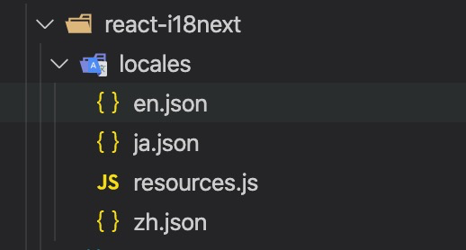

国际化可以使web站点或者app在不同的国家或者地区使用。可以国际化的内容有文本，日期、时间和数字的格式，还有货币等。目前市场上流行的react国际化框架主要有react-i18n和react-intl，本文主要以文本国际化来两种方案的入门用法及对比。


## React-i18next
### 介绍
react-i18next是基于i18next的一款强大的国际化框架，可以用于react和react-native应用，以下是react-i18next一些特点：
- 基于i18next不仅限于react，学一次就可以用在其它地方
- 提供多种组件在hoc、hook和class的情况下进行国际化操作
- 适合服务端的渲染
- 历史悠久，始于2011年比大多数的前端框架都要年长
- 因为历史悠久所以更成熟，目前还没有i18next解决不了的国际化问题
-  有许多插件的支持，比如可以用插件检测当前系统的语言环境，从服务器或者文件系统加载翻译资源

### 准备开始
1. 安装依赖
```
# npm
$ npm install react-i18next i18next --save
# 如果需要检测当前浏览器的语言或者从服务器获取配置资源可以安装下面依赖
$ npm install i18next-http-backend i18next-browser-languagedetector --save
```
2. 在locales文件中添加多语言配置文件，文件类型为json。

```json
#en.json
{
    "欢迎使用 react-i18next": "Welcome to react using react-i18next",
    "切换语言": "change language",
    "切换到中文": "change to Chinese",
    "切换到英文": "change to English",
    "切换到日文": "change to Japenese",
    "methods": {
        "renderProps": "change language with render props",
        "hook": "change language with hook",
        "hoc": "change language with hoc"
 }
```   
```json
#ja.json
{
    "欢迎使用 react-i18next": "ご利用を歓迎する react-i18next",
    "切换语言": "言語を切り替える",
    "切换到中文": "中国語に切り替える",
    "切换到英文": "英文に切り替える",
    "切换到日文": "日本語に切り替える",
    "methods": {
        "renderProps": "renderProps方式で言語を変換する",
        "hook": "hook方式で言語を変換する",
        "hoc": "hoc方式で言語を変換する"
    }
}
```  
```json
#zh.json
{
    "methods": {
        "renderProps": "用renderProps转换",
        "hook": "用hook转换",
        "hoc": "用hoc转换"
    }
}
```  
3. 初始化配置，新建i18n.js文件，对i18n进行初始化操作及插件配置
```js
import i18n from 'i18next';
import { initReactI18next } from 'react-i18next';

import Backend from 'i18next-http-backend';
import LanguageDetector from 'i18next-browser-languagedetector';

import resources from './locales/resources'
// don't want to use this?
// have a look at the Quick start guide 
// for passing in lng and translations on init

i18n
  // load translation using http -> see /public/locales (i.e. https://github.com/i18next/react-i18next/tree/master/example/react/public/locales)
  // learn more: https://github.com/i18next/i18next-http-backend
  .use(Backend)
  // detect user language
  // learn more: https://github.com/i18next/i18next-browser-languageDetector
  .use(LanguageDetector)
  // pass the i18n instance to react-i18next.
  .use(initReactI18next)
  // init i18next
  // for all options read: https://www.i18next.com/overview/configuration-options
  .init({
    fallbackLng: 'zh',
    lng: 'zh',
    debug: true,
    resources: resources,
    interpolation: {
      escapeValue: false, // not needed for react as it escapes by default
    }
  });

export default i18n;
```

4. 将**i18n.js**文件引入到入口文件中App.js
```js
import React from 'react';
import './i18n';

export default class App extends React.Component {

    render() {
        return (
            <div>
                {/* 省略...... */}
            </div>
        )
    }
}

```
5. 切换语言
```js
<Button onClick={() => i18n.changeLanguage('zh')}>{t('切换到中文')}</Button>
```
6. 通过RenderProps的方式国际化组件
```js
import React from 'react';
import { Translation } from 'react-i18next';

const Index = () => {
    return (
        <Translation>
            {
                t => {
                    return (
                        <div style={{background: 'red', margin: 20, color: 'white', width: 200}}>
                            {t('methods.renderProps')}
                        </div>
                    );
                }
            }

        </Translation>
    )
}

export default Index;
```

7. 在hook中使用react-i18next国际化

```js
import React from 'react';
import { useTranslation } from 'react-i18next';

const Index = () => {
    const { t } = useTranslation();
    return (
        <div style={{ background: 'yellow', margin: 20, width: 200 }}>
            {t('methods.hook')}
        </div>
    )
}

export default Index;
```

8. 使用高阶组件（Hoc）的方式处理国际化
```js
import React from 'react';
import { withTranslation } from 'react-i18next';

const Index = ({ t }) => {
  return (
    <div style={{ background: 'blue', margin: 20, color: 'white', width: 200 }}>
      {t('methods.hoc')}
    </div>
  );
}

export default withTranslation()(Index);
```

## React-intl
#### 介绍
React-intl通过context api的方式为react项目提供多语言支持，可以对文本、数字、日期等进行翻译。
#### 准备开始
1. 安装依赖
```
npm i -S react-intl
```

2. 在locales文件夹中创建多语言资源文件，与i18next不同的是，资源文件的类型为js类型，导出的是一个对象，因为翻译的文本中可以存在变量灵活替换，比如代码中的 **{ value }**。


```js
export default {
    welcome: "Welcome to use react-intl",
    changeToChinese: "change to Chinese",
    changeToEnglish: "change to English",
    changeToJapanese: "change to Japanese",
    description: "description",
    value: "use value {value}",
    function: "function as the child"
}
```
```js
export default {
    welcome: "react−intlの使用を歓迎します",
    changeToChinese: "中国語に切り替える",
    changeToEnglish: "英文に切り替える",
    changeToJapanese: "日本語に切り替える",
    description: "描写",
    value: "値を使う（value) {value}",
    function: "関数はサブセットとする"
}
```

3. 初始化，将入口文件的组件App包裹在IntlProvider组件中。
```js
import React from 'react';
import { IntlProvider, FormattedMessage } from 'react-intl';
import App from './App';

export default class Index extends React.Component {

    render() {
        const { locale } = this.state;
        return (
            <IntlProvider locale={locale} messages={this.messages[locale]}>
                <App >
            </IntlProvider>
        )
    }
}
```
4. 切换语言，react-intl没有提供切换语言的接口，所以需要开发者手动完成。以下是通过按钮点击修改state中语言的类型来切换语言的。
```js
import React from 'react';
import { IntlProvider, FormattedMessage } from 'react-intl';
import { Button, Row, Col } from 'antd';
import zh from './locales/zh';
import en from './locales/en';
import ja from './locales/ja';

export default class Index extends React.Component {

    messages = {
        zh: zh,
        en: en,
        ja: ja
    }
    state = {
        locale: 'zh'
    }

    render() {
        return (
            <IntlProvider locale={this.state.locale} messages={this.messages[this.state.locale]}>
                <Row gutter={16} style={{ margin: 20 }}>
                    <Col>
                        <Button onClick={() => this.setState({ locale: 'zh' })}>
                            <FormattedMessage id='changeToChinese' />
                        </Button>
                    </Col>
                    <Col>
                        <Button onClick={() => this.setState({ locale: 'en' })}>
                            <FormattedMessage id='changeToEnglish' />
                        </Button>
                    </Col>
                    <Col>
                        <Button onClick={() => this.setState({ locale: 'ja' })}>
                            <FormattedMessage id='changeToJapanese' />
                        </Button>
                    </Col>
                </Row>
            </IntlProvider>
        )
    }
}
```

5. 与react-i18next不同，react-intl只提供了组件（文本组件 **FormattedMessage**）和api（**intl.formatMessage()**）的方式来进行国际化处理，通过id获取对应的语言文本进行国际化。
```js
<div style={{ margin: 20, background: 'red', color: 'white', width: 233 }}>
    <FormattedMessage id='welcome' />
</div>
```

6. 使用缺省消息，如果当前的id在当前语言的资源文件中没有对应的配置，那就会显示defaultMessage中的文本。
```js
<div style={{ margin: 20, background: 'purple', color: 'white', width: 233 }}>
    <FormattedMessage id='defaultMessage' defaultMessage='使用缺省消息' />
</div>
```

7. 使用描述
```js
<div style={{ margin: 20, background: 'black', color: 'white', width: 233 }}>
    <FormattedMessage id='description' defaultMessage='描述' description='使用描述' />
</div>
```

8. 通过value传值
```js
<div style={{ margin: 20, background: 'blue', color: 'white', width: 233 }}>
    <FormattedMessage id='value' values={{ value: 233 }} />
</div>
```

9. 函数作为FormattedMessage的子组件，可以通过这种方式来传递国际化的组件。
```js
<div style={{ margin: 20, background: 'green', color: 'white', width: 233 }}>
    <FormattedMessage id='function'>
        {
            txt => (
                <div style={{fontSize: 30}}>{txt}</div>
            )
        }
    </FormattedMessage>
</div>
```

#### 对比

- React-i18next初始化的时候需要将初始化配置放置在初始化文件（i18n.js）中，然后将初始化文件(i18n.js)通过import的方式引入到入口文件中即可。当然也可以通过I18nextProvider将i18n往下传递到各子组件。React-intl提供的是context api初始化方案，需要将初始化配置放在IntlProvider组件中，并且将入口文件的组件（如<App>)作为IntlProvider的子组件来使用；
- React-i18next提供了切换语言的接口(i18n.changeLanguage)，react-intl则需要对切换做一些封装的工作；
- React-i18next提供了三种方式进行国际化操作（render props、hook和hoc)， react-intl提供了api（intl.formatMessage()）和组件(<FormattedMessage />)两种方式进行国际化；
- React-i18next的语言资源文件为json格式，react-intl为js格式，同时支持变量传值；
- React-i18next有很多插件可以使用比如检测当前系统语言，从后端获取数据等；
- React-intl除文本翻译外还提供日期、时间和金额的国际化支持；
- React-i18next的npm周下载量681,123次，一个月前有更新，包大小为298 kB。React-intl的npm周下载量780,176次，一周前有更新，包大小为513 kB。

#### 参考文档
- https://react.i18next.com/
- https://formatjs.io/
- https://blog.bitsrc.io/react-i18n-how-to-internationalize-your-react-application-3a12bba5a980

#### Demo 地址
https://github.com/freezing2616/react-i18n-demo
